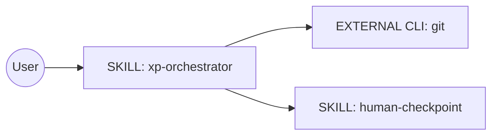
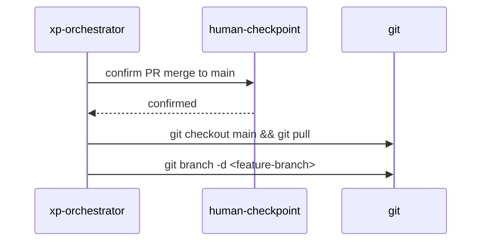
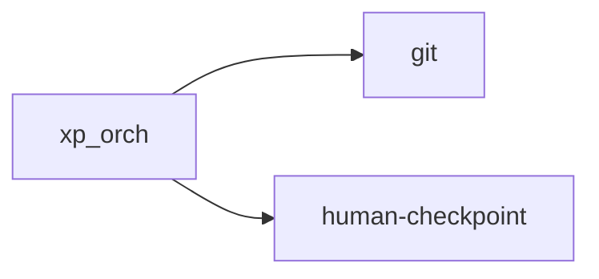

# Genesis Handoff Packet: XP Orchestrator Phase 5 Update

## Intent + Scope
**Intent:** Update the `xp-orchestrator` skill (specifically Phase 5) to delete the local feature branch after the human confirms the PR merge.
**Trigger Nouns/Verbs:** User requests to update the XP Orchestrator. 
**Boundary:** This module only manages the local `git` cleanup. It relies on GitHub to handle remote branch cleanup.
**Dispatch Description:** Use this orchestrator to manage the development lifecycle of a mobile application using extreme programming. It triggers when a new mobile app project is initiated or when new features are added to an existing backlog. It routes tasks to an agentic development team, persists plans in `.agents/plans/`, manages iterative development on a feature branch (with human verification to prevent branch nesting or misalignment), pauses for human architectural approvals, resilient tool acquisition, post-packaging manual testing, and final release packaging from main after PR merge, uploading the artifact to a release tag.
**Cost Stance:** frugal

## Component Diagram

## Sequence Diagram

## Dependency Graph

## Interface Sketch
- **Module:** `xp-orchestrator`
- **Trigger:** PR merge to main completed.
- **Inputs:** Branch merge confirmation.
- **Outputs:** Execution of `git branch -d`.
- **Dependencies:** `git`.

## Module Composition Table
| Module | Mode | Rationale |
|---|---|---|
| `xp-orchestrator` | LOCAL SIBLING | Existing module being refactored |
| `git` | EXTERNAL MODULE | Standard CLI dependency |

## External Modules Required
- `git`
- Declaration Mechanism: Declared in `DEPENDENCIES` section of `SKILL.md`.

## Declared Target Set
`common-only`

## Invocation Mode
FORCED | DISCOVERY

## Compliance Findings
- No blockers.

## Todo List
- [ ] Update `C:\SourceCode\MealHelper\.agents\skills\xp-orchestrator\SKILL.md` Phase 5, step 4.
- [ ] Validate changes.

## Per-Spawn Declaration Table
| Task/Spawn | Audience | Tier | Brief Mode | Receipt Mode | Justification |
|---|---|---|---|---|---|
| git command | INTERNAL | 1 | caveman | none | standard CLI interaction |

## Evals Plan
- **Content Evals:** Run `xp-orchestrator` Phase 5 `with_skill` vs `without_skill` and observe if the local branch is successfully deleted after PR merge.

## Cost Projection
- **Role Class:** planner
- **Prefix / Output Bands:** S
- **Workflow-level:** Minimal token impact.
- **Cap Check:** Within limits.
