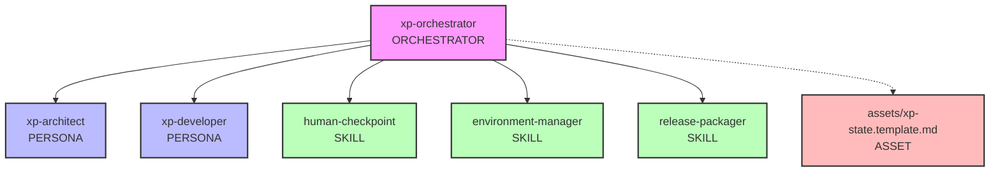
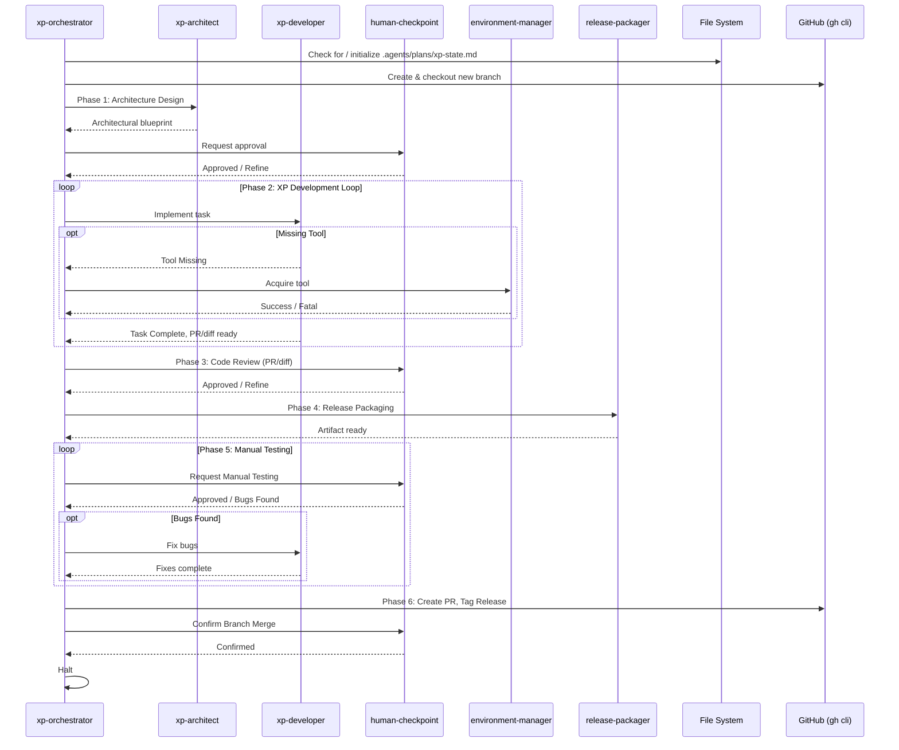
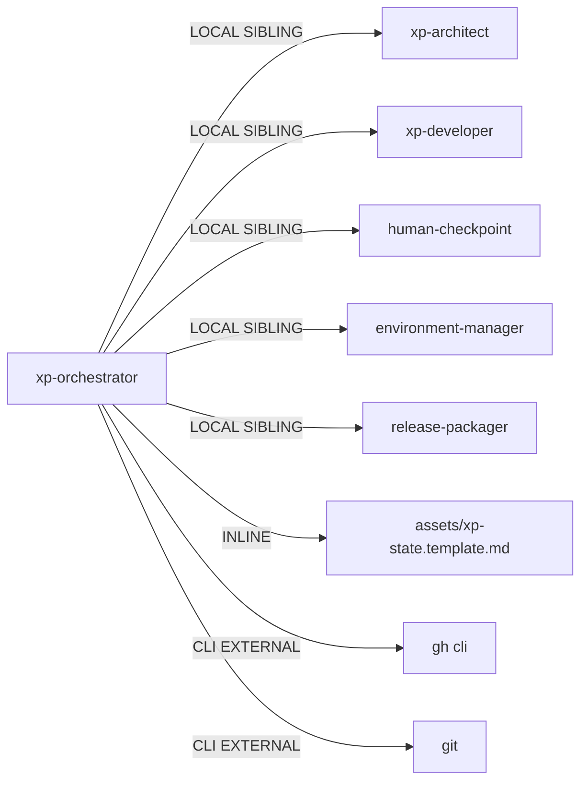

# Genesis Handoff Packet: xp-orchestrator update

## Step 1 - Intent + Scope
**User-facing capability**: Manages the development lifecycle of a mobile application using extreme programming, ensuring branch isolation, persistent plans, human testing, and GitHub release automation.
**Trigger conditions**: Use this orchestrator when a new mobile app project is initiated, or when new features are added to an existing backlog.
**Boundary**: It does not write code itself, nor does it deploy to app stores. It only orchestrates the lifecycle up to the point of a confirmed GitHub release merge.

**Dispatch Description**:
Use this orchestrator to manage the development lifecycle of a mobile application using extreme programming. It triggers when a new mobile app project is initiated or when new features are added to an existing backlog. It routes tasks to an agentic development team, persists plans in `.agents/plans/`, requires development on a new branch, pauses for human architectural approvals, PR reviews, resilient tool acquisition, and post-release manual testing. It creates a PR and GitHub release tag, bounding only when the branch merge is confirmed. (FORCED | DISCOVERY)

## Step 2 - Component Diagram

## Step 3 - Thread / Sequence Diagram

## Step 3.5 - Dependency Graph Diagram

## Step 4, 5 & 6 - Remainder of Packet

**Module Composition Table**:
- `xp-orchestrator`: INLINE (this module)
- `xp-architect`: LOCAL SIBLING
- `xp-developer`: LOCAL SIBLING
- `human-checkpoint`: LOCAL SIBLING
- `environment-manager`: LOCAL SIBLING
- `release-packager`: LOCAL SIBLING
- `assets/xp-state.template.md`: INLINE

**External Modules Required**: `git`, `gh` (CLI tools).

**Declared Target Set**: `common-only`

**Invocation Mode**: BOTH

**Todo List**:
1. [ ] Update `xp-orchestrator/SKILL.md` to move `xp-state.md` to `.agents/plans/xp-state.md`.
2. [ ] Add step in Phase 0 to create and check out a new branch.
3. [ ] Add Phase 5 for Manual Testing Loop routing back to `xp-developer`.
4. [ ] Add Phase 6 for GitHub PR, Release Tag, and Human confirmation of branch merge.

**Per-Spawn Declaration Table**:
- `xp-architect`: INTERNAL / Tier 3 / caveman / caveman / Domain architect
- `xp-developer`: INTERNAL / Tier 2 / caveman / caveman / Feature implementer

**Cost Projection**:
- Operator stance: balanced
- Expected to invoke multiple LLM calls. Bounded by human checkpoints.

**Evals Plan**:
- *Content Evals*: Check if orchestrator correctly branches off and creates PR.
- *Trigger Evals*: "Start a new mobile feature" -> should trigger. "Write a python script" -> should NOT trigger.
