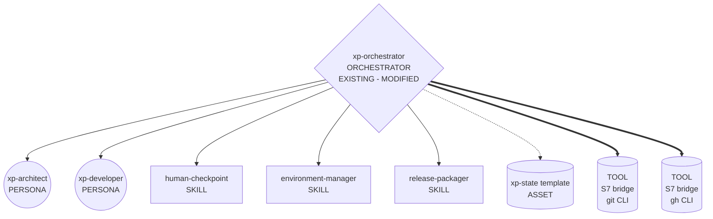
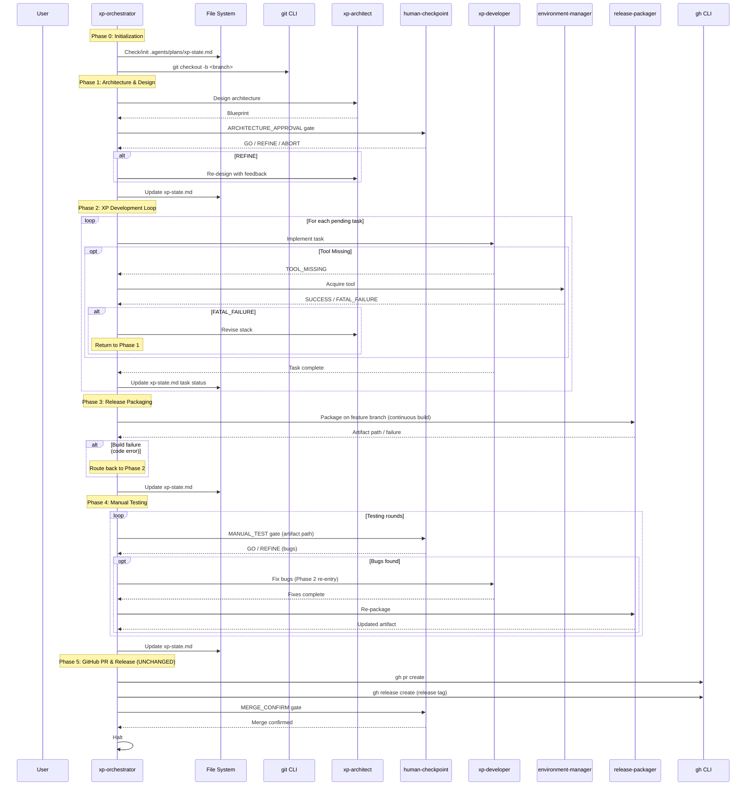
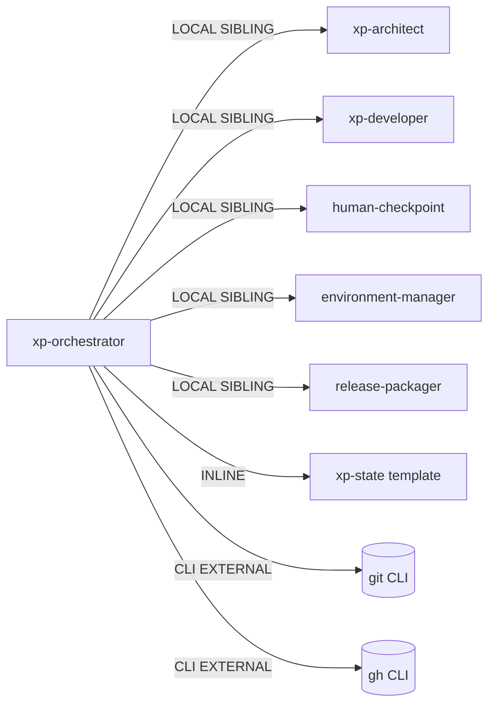

# Genesis Handoff Packet: xp-orchestrator Refactor (v2)

> [!IMPORTANT]
> This is the design plan for refactoring the xp-orchestrator module.
> DESIGN ENDS HERE — no natural-language module drafting until this packet is approved.

## Step 1 — Intent + Scope

**User-facing capability**: The xp-orchestrator manages the development
lifecycle of a Flutter mobile application using extreme programming
methodology. It routes tasks to an agentic development team (architect,
developer personas), persists plans in `.agents/plans/`, requires
development on a new branch, pauses for human architectural approvals,
handles resilient tool acquisition, performs release packaging on the
feature branch (updating the continuous build without merging to main),
gates on manual testing, and creates a PR + release tag for human-driven
merge.

**Trigger conditions**: New mobile app project initiated, or new features
added to an existing backlog.

**Boundary**: Does NOT write code itself. Does NOT deploy to app stores.
Release packaging (Phase 3) does NOT merge branches, create PRs, or
create build tags — it only builds on the current feature branch. PR
creation, release tagging, and merge confirmation happen in Phase 5
(unchanged from original Phase 6).

**Refactor rationale** (what changed from v1):
1. **Phase 3 (Code Review) REMOVED** — redundant with the PR review gate
   in Phase 5 (original Phase 6). The human reviews code when the PR is
   created; a separate pre-PR code review checkpoint adds no value.
2. **Release Packaging moved BEFORE Manual Testing** — the human needs a
   packaged artifact to test. Packaging builds on the feature branch to
   update the continuous build. It does NOT merge to main, create PRs,
   or create release tags (unless explicitly asked by the human).
3. **Phase 6 (GitHub PR & Release) is UNCHANGED** — retains PR creation,
   release tag creation, merge confirmation gate, and halt behavior
   exactly as the original.

**Dispatch description** (556 chars):
```
Use this orchestrator to manage the development lifecycle of a mobile
application using extreme programming. It triggers when a new mobile
app project is initiated or when new features are added to an existing
backlog. It routes tasks to an agentic development team, persists plans
in `.agents/plans/`, requires development on a new branch, pauses for
human architectural approvals, resilient tool acquisition, release
packaging on the feature branch, and post-packaging manual testing.
It creates a PR and GitHub release tag, bounding when merge is confirmed.
```

**Invocation mode**: BOTH (FORCED + DISCOVERY)

**Cost stance**: `balanced` | No cap declared.

---

## Step 2 — Component Diagram

Refactor pattern triggers applied (R-patterns):
- **R1 SPLIT**: Not triggered. Single responsibility (lifecycle orchestration).
- **R2 FUSE**: Not triggered. No tiny siblings with lockstep co-invocation.
- **R3 EXTRACT**: Not triggered. No duplicated inline content.
- **R4 INLINE**: Not triggered. No thin proxies.
- **R5 COST PRUNE**: Not triggered (balanced stance, no observed cost hotspots).

No R-pattern fires. The refactor is a PROCEDURE REDESIGN within the
existing module, not a structural graph change.



All modules are EXISTING. Only `xp-orchestrator` is modified (procedure
change, not interface change).

---

## Step 3 — Thread / Sequence Diagram

**Architectural pattern**: A4 STAFFED PLAN + A2 PIPELINE (unchanged from v1).
The workflow is a linear pipeline of gated phases with staffed task
assignments. No fan-out (each phase has one actor at a time).

**Tier 2 design patterns applied**:
- **B4 PLAN MEMENTO** (mandatory): `.agents/plans/xp-state.md` reloaded
  at phase boundaries and after spawn returns.
- **B8 ATTENTION ANCHOR** (mandatory): Current objective re-injected from
  plan at each phase start.
- **B10 HUMAN CHECKPOINT**: Gates at architecture approval, manual testing,
  and merge confirmation.
- **S7 DETERMINISTIC TOOL BRIDGE**: `git` for branch creation, `gh` for
  PR creation and release tagging.
- **A9 SUPERVISED EXECUTION**: Environment manager wraps tool acquisition
  in plan → execute → verify.

**Revised phase flow** (6 phases, 0-indexed):

| Phase | Name | Actor(s) | Gate |
|-------|------|----------|------|
| 0 | Initialization | orchestrator | — |
| 1 | Architecture & Design | xp-architect → human-checkpoint | ARCHITECTURE_APPROVAL |
| 2 | XP Development Loop | xp-developer, environment-manager | — |
| 3 | Release Packaging | release-packager | — |
| 4 | Manual Testing | human-checkpoint → xp-developer (if bugs) | MANUAL_TEST |
| 5 | GitHub PR & Release | gh CLI → human-checkpoint | MERGE_CONFIRM |

**Key diff from v1**: Old Phase 3 (Code Review) removed. Old Phase 4
(Release Packaging) becomes new Phase 3. Old Phase 5 (Manual Testing)
becomes new Phase 4. Old Phase 6 (GitHub PR & Release) becomes new
Phase 5 — **procedure unchanged**.



### Step 3.1 — Tradeoff Check

No tradeoff check needed. Pattern selection was unambiguous:
- A4 STAFFED PLAN + A2 PIPELINE fits the linear gated lifecycle.
- No fan-out opportunity (phases are sequential with dependencies).
- No alternative patterns in tension.

### Step 3.2 — Cost Check

**Cost stance**: `balanced`

| Module | Role Class | Prefix Shape | Output Band | Tool Surface | Notes |
|--------|-----------|-------------|-------------|-------------|-------|
| xp-orchestrator | planner | stable (persona + skill bodies cached) | S (terse dispatch) | git, gh, file ops | Orchestration only |
| xp-architect | researcher | stable (persona cached) | M (blueprint) | file read | Design output |
| xp-developer | implementer | stable (persona + task cached) | L (code) | file read/write, terminal | Code output |
| human-checkpoint | trivial | stable | S (verdict) | none | Gate only |
| environment-manager | trivial | stable | S (status) | terminal | Tool acquisition |
| release-packager | trivial | stable | S (path) | terminal | Build only |

No R5 COST PRUNE triggers fire. B13 CACHE-AWARE PREFIX satisfied:
persona bodies are stable leading bytes, variable content follows.

**PER-SPAWN DECLARATION TABLE**:

| Spawn | Audience | Tier | Brief Mode | Receipt Mode | Justification |
|-------|----------|------|-----------|-------------|---------------|
| xp-architect | INTERNAL | researcher | caveman | caveman | Structured blueprint output |
| xp-developer | INTERNAL | implementer | caveman | caveman | Code + status output |
| human-checkpoint | EXTERNAL | trivial | normal | normal | Human-facing, needs clear prose |
| environment-manager | INTERNAL | trivial | caveman | caveman | Status only |
| release-packager | INTERNAL | trivial | caveman | caveman | Path + status only |

### Step 3.5 — Composition Decision

No composition changes from v1. All modules retain existing modes:

| Module | Mode | Rationale |
|--------|------|-----------|
| xp-orchestrator | INLINE | Core module, this is the design target |
| xp-architect | LOCAL SIBLING | Persona reused only within this project |
| xp-developer | LOCAL SIBLING | Persona reused only within this project |
| human-checkpoint | LOCAL SIBLING | Reused across orchestrator gates |
| environment-manager | LOCAL SIBLING | Reused across dev workflows |
| release-packager | LOCAL SIBLING | Reused for packaging |
| xp-state.template.md | INLINE | Asset within orchestrator |



**External modules required**: None (git and gh are CLI tools, not
agentic modules).

---

## Step 4 — SoC Pass

| Check | Result |
|-------|--------|
| Duplicate of existing module? | No. xp-orchestrator is unique. |
| Overlapping trigger conditions? | No. Other skills have distinct triggers. |
| Dispatch description collision? | No. "development lifecycle" + "extreme programming" unique. |
| R1 SPLIT triggers? | No. Single responsibility. |
| R2 FUSE triggers? | No. No lockstep siblings. |
| R3 EXTRACT triggers? | No. No duplicated inline content. |
| R4 INLINE triggers? | No. No thin proxies. |
| Consequential side effects via S7? | Yes: `git checkout -b`, `gh pr create`, `gh release create`. All cross S7 via CLI. ✓ |
| Facts-that-must-be-true? | Plan file existence, branch existence — checked via tools. ✓ |

No issues found.

---

## Step 5 — Compliance Check

| Principle | Status | Notes |
|-----------|--------|-------|
| Single Responsibility | ✓ | One job: lifecycle orchestration |
| Progressive Disclosure (PROSE) | ✓ | Plan template loaded lazily |
| Reduced Scope (PROSE) | ✓ | Each phase has focused scope |
| Orchestrated Composition (PROSE) | ✓ | Orchestrator composes skills |
| Safety Boundaries (PROSE) | ✓ | Human checkpoints at all gates |
| Explicit Hierarchy (PROSE) | ✓ | Clear parent-child relationships |
| Truth #1 (attention decays) | ✓ | B4 + B8 applied |
| Truth #2 (context explicit) | ✓ | All handoffs via plan artifact |
| Truth #3 (hallucination risk) | ✓ | S7 for all side effects |
| Truth #5 (plan before execution) | ✓ | Plan persisted at Phase 0 |
| `name` regex | ✓ | `xp-orchestrator` passes `[a-z0-9-]` |
| `name` = dir name | ✓ | `.agents/skills/xp-orchestrator/` |
| Body ≤ 500 lines | ✓ | ~65 lines, refactored will be ~60 |
| `description` ≤ 1024 chars | ✓ | 556 chars |

**No BLOCKER findings.**

---

## Step 6 — Summary & Todos

### Declared Target Set
`common-only`

### Invocation Mode
BOTH (FORCED + DISCOVERY)

### Compliance Findings
None open.

### External Modules Required
None.

### HUMAN_RATIONALE

The user identified two concrete improvements after using the v1 orchestrator:

1. **Phase 3 (Code Review) is redundant.** The PR created in Phase 6
   already triggers a human review. A separate code review checkpoint
   before packaging is duplicate friction — same code, reviewed twice.

2. **Release Packaging scope was unclear.** Phase 4 (Release Packaging)
   should build on the feature branch to update the continuous build
   artifact. It must NOT merge to main, create PRs, or create release
   tags (unless the human explicitly asks). Those actions belong in
   Phase 6 (now Phase 5), which is unchanged.

The refactored flow removes one phase:
```
Phase 0: Init → Phase 1: Architect → Phase 2: Develop →
Phase 3: Package (feature branch) → Phase 4: Manual Test →
Phase 5: GitHub PR & Release (UNCHANGED from original Phase 6)
```

> [!CAUTION]
> HUMAN_RATIONALE is NEVER copied into any SPAWN_BRIEF.

### Changes to Apply

The ONLY file that needs editing is `xp-orchestrator/SKILL.md`. Specifically:

```diff
 **Phase 2: XP Development Loop**
   (unchanged)

-**Phase 3: Code Review**
-1. Invoke the `human-checkpoint` skill to request a human review of the developer's PR/diff.
-2. If the human requests changes (REFINE), re-invoke the `xp-developer` with the human's feedback and repeat Phase 3.
-3. If approved (GO), update `.agents/plans/xp-state.md` and proceed to Phase 4.
-
-**Phase 4: Release Packaging**
+**Phase 3: Release Packaging**
 1. Invoke the `release-packager` skill to bundle the completed code into an artifact.
-2. Once the packager reports success, present the final output path to the user and proceed to Phase 5.
+2. The packager builds on the CURRENT FEATURE BRANCH to update the continuous build. It MUST NOT merge to main, create pull requests, or create new build tags (unless explicitly requested by the human).
+3. Once the packager reports success, present the final output path to the user and proceed to Phase 4.

-**Phase 5: Manual Testing Loop**
+**Phase 4: Manual Testing Loop**
 1. Invoke the `human-checkpoint` skill to request a human to manually test the packaged application to identify any issues or bugs.
 2. If the human finds bugs or issues, route back to Phase 2: invoke the `xp-developer` to address the specific feedback.
-3. If the human approves the release, proceed to Phase 6.
+3. If the human approves the release, proceed to Phase 5.

-**Phase 6: GitHub PR & Release**
+**Phase 5: GitHub PR & Release**
 1. Use the GitHub CLI (`gh pr create`) to create a pull request for the new branch.
 2. Use the GitHub CLI (`gh release create`) or git to create a new release tag in GitHub so the branch can be merged for GitHub release.
 3. Invoke the `human-checkpoint` skill to ask the human to confirm that the branch merge has been completed.
 4. Once the branch merge is confirmed and the release fully completed, halt execution.
```

### Todo List

| # | Task | Status | Dep |
|---|------|--------|-----|
| 1 | Update `xp-orchestrator/SKILL.md` — remove Phase 3 (Code Review), renumber phases, add packaging constraints | DONE | — |
| 2 | Validate updated module against this handoff packet | DONE | 1 |

### EVALS PLAN

**Content Evals** (2):

1. **Prompt**: "Add a grocery list generator feature to MealHelper"
   - **With skill**: Follows 6-phase pipeline (0-5). Packages on feature
     branch. Creates PR + release tag. Waits for human merge. No separate
     code review gate between development and packaging.
   - **Without skill**: Ad-hoc development, may skip architecture review
     or attempt direct merge.

2. **Prompt**: "The ingredient sorting is broken, fix it"
   - **With skill**: Bug enters backlog → developer fixes → package rebuilt
     on feature branch → human tests artifact → PR + release tag created.
   - **Without skill**: Inline fix without branch isolation or test gates.

**Trigger Evals** (~20, 60/40 train/val):

| # | Query | Should Trigger? | Split |
|---|-------|----------------|-------|
| 1 | "Start a new mobile feature for meal planning" | YES | TRAIN |
| 2 | "Add user authentication to the app" | YES | TRAIN |
| 3 | "Build a shopping list screen" | YES | TRAIN |
| 4 | "I want to add dark mode to MealHelper" | YES | TRAIN |
| 5 | "Create a new screen for recipe sharing" | YES | TRAIN |
| 6 | "Fix the navigation bar and add a settings page" | YES | TRAIN |
| 7 | "Implement push notifications for meal reminders" | YES | VAL |
| 8 | "Add a favorites system to the meal database" | YES | VAL |
| 9 | "Build an export feature for meal plans" | YES | VAL |
| 10 | "The sort order is wrong on the ingredients screen" | YES | VAL |
| 11 | "What's the weather today?" | NO | TRAIN |
| 12 | "Write a Python script to parse CSV files" | NO | TRAIN |
| 13 | "Help me write a README for this project" | NO | TRAIN |
| 14 | "Explain how Flutter state management works" | NO | TRAIN |
| 15 | "Review this pull request" | NO | TRAIN |
| 16 | "Set up a CI/CD pipeline" | NO | TRAIN |
| 17 | "Design a database schema for a web app" | NO | VAL |
| 18 | "Help me debug this JavaScript error" | NO | VAL |
| 19 | "Create a new skill for code review" | NO | VAL |
| 20 | "What testing framework should I use?" | NO | VAL |

### COST PROJECTION

**Operator stance**: `balanced` | No cap.

| Module | Role Class | Prefix Band | Output Band | Turns | Cache Ratio |
|--------|-----------|-------------|-------------|-------|-------------|
| xp-orchestrator | planner | M | S (dispatch) | 10-15 | high |
| xp-architect | researcher | M | M (blueprint) | 2-4 | high |
| xp-developer | implementer | M | L (code) | 5-20 | medium |
| human-checkpoint | trivial | S | S (verdict) | 1 each | high |
| environment-manager | trivial | S | S (status) | 1-3 | high |
| release-packager | trivial | S | S (path) | 1-2 | high |

| Scenario | Input Tokens | Output Tokens | Est. Cost |
|----------|-------------|---------------|-----------|
| S (1 small task, no tool issues) | ~50K | ~20K | $0.10-0.30 |
| M (3-5 tasks, one tool acquisition) | ~200K | ~80K | $0.50-1.50 |
| L (8+ tasks, re-architecture needed) | ~500K | ~200K | $2.00-5.00 |

---

> [!NOTE]
> **DESIGN ENDS HERE.** Approve this packet to proceed with Step 7
> (drafting the updated `xp-orchestrator/SKILL.md`).
