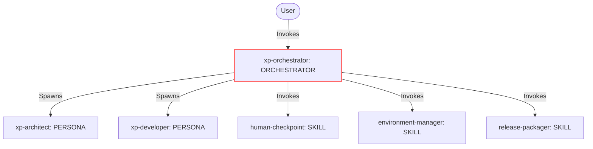
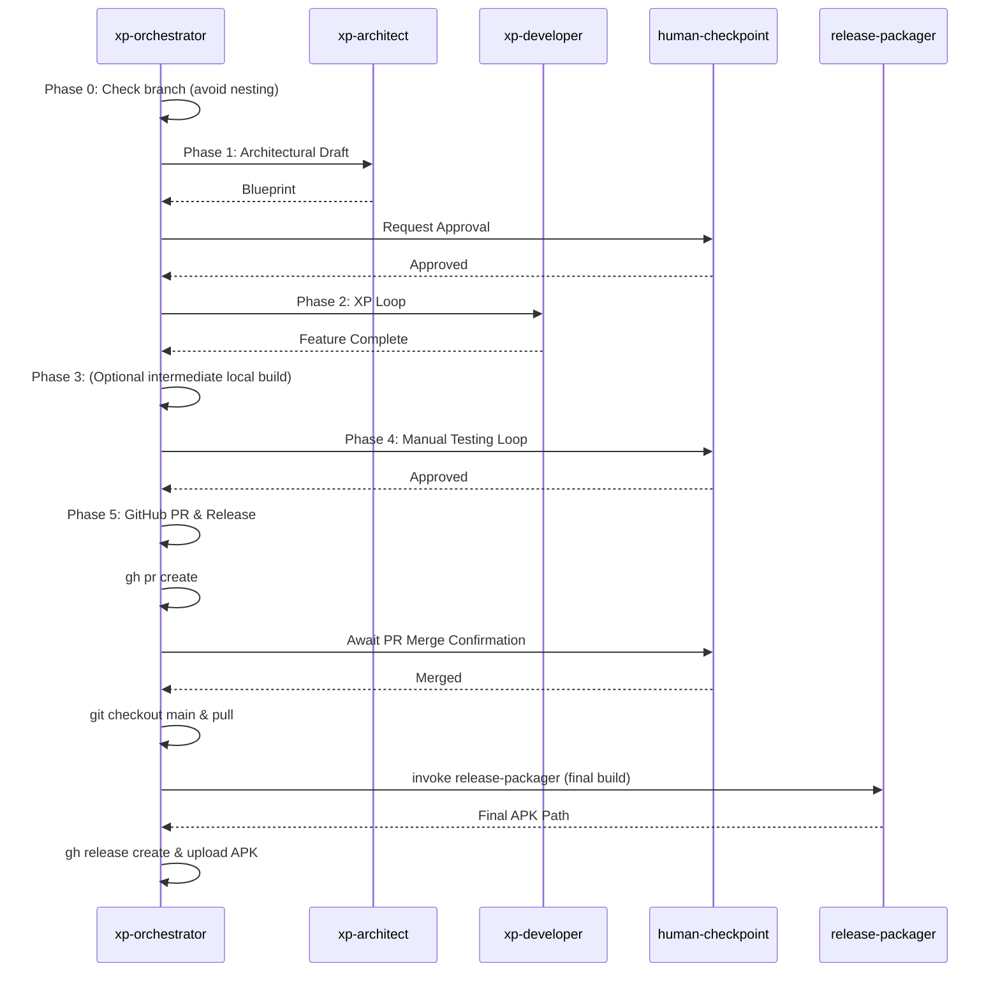

# Genesis Design Plan: xp-orchestrator Refactor

## Step 1: Intent + Scope

**Intent:** Refactor the `xp-orchestrator` skill to better handle iterative development and release packaging. The orchestrator must intelligently manage branches—avoiding the creation of nested feature branches when the workspace is already on an active feature branch. Additionally, the final release build and APK generation must be deferred to Phase 5. In this phase, after the PR is merged, the orchestrator will check out the `main` branch, build the final APK, and upload it to the newly created GitHub release tag.
**Trigger Conditions:** Initiated when a user runs the xp-orchestrator or when mobile app XP lifecycle management is requested.
**Boundary:** Does not alter the core extreme programming loop or the nature of the human architectural/testing approvals. Does not implement the low-level build scripts.

**Dispatch Description:**
Use this orchestrator to manage the development lifecycle of a mobile application using extreme programming. It triggers when a new mobile app project is initiated or when new features are added to an existing backlog. It routes tasks to an agentic development team, persists plans in `.agents/plans/`, manages iterative development on a feature branch (without nesting), pauses for human architectural approvals, resilient tool acquisition, post-packaging manual testing, and final release packaging from main after PR merge, uploading the artifact to a release tag.

## Step 2: Component Diagram

## Step 3: Thread / Sequence Diagram

## Step 3.5: Composition Decision

- `xp-orchestrator`: INLINE orchestrator rule.
- `xp-architect`, `xp-developer`: LOCAL SIBLING personas.
- `human-checkpoint`, `environment-manager`, `release-packager`: LOCAL SIBLING skills.
No EXTERNAL MODULES declared.

## Step 4: SoC Pass

- No overlapping trigger conditions.
- No need to split/fuse. The change is isolated to updating Phase 0 and Phase 5 logic in the existing `xp-orchestrator`.

## Step 5: Compliance Check

- Passes PROSE constraints.
- `name` matches parent directory.
- `description` < 1024 chars, imperative, intent-first.
- File size within budget.

## Step 6: Handoff Packet

- **Declared target set**: `common-only`
- **Invocation mode**: BOTH
- **Cost Projection**: Frugal/Balanced stance. Output volume minimal (orchestrator simply routes and issues system commands).
- **Todos**:
  1. Modify `Phase 0: Initialization` in `xp-orchestrator/SKILL.md` to check `git branch --show-current` before running `git checkout -b`.
  2. Modify `Phase 3: Release Packaging` in `xp-orchestrator/SKILL.md` to note it's for intermediate testing if applicable, or remove build requirement from this phase. Wait, the instructions specify we want final release to build from main. So Phase 3 can just do an intermediate test package, or just be removed if not needed. We'll leave Phase 3 as-is for the feature branch (for manual testing in Phase 4), but clarify it doesn't upload.
  3. Modify `Phase 5: GitHub PR & Release` in `xp-orchestrator/SKILL.md`:
     - Create PR.
     - Human confirms PR merge.
     - Checkout `main`, pull.
     - Invoke `release-packager` to build final APK.
     - Create release tag and upload APK.
