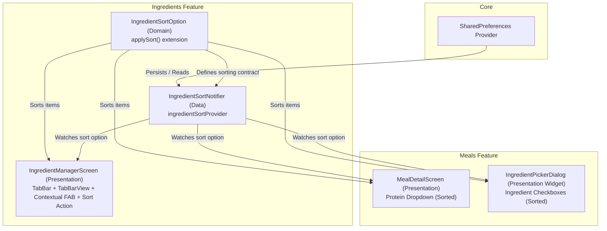
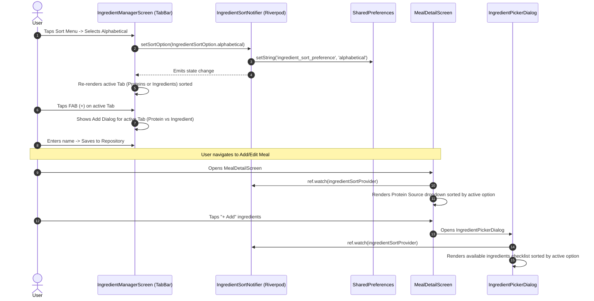

# Architectural Blueprint: Ingredients Sorting & Tabbed UI/UX Architecture

## 1. Executive Summary & Approved Direction
Based on human design review, **Option 1 (Top TabBar Navigation)** is approved.

### Core Objectives:
1. **Persistent Sorting (`IngredientSortOption`)**: Add sorting capability to the Ingredients feature domain (`lib/features/ingredients/domain/ingredient_sort_option.dart`), managed via `IngredientSortNotifier` in data layer and persisted in `SharedPreferences` via `sharedPreferencesProvider`.
2. **Cross-Feature Sort Propagation**: Propagate the chosen sort option to:
   - `MealDetailScreen` (Protein Source dropdown options).
   - `IngredientPickerDialog` (Ingredient multi-select checkbox list).
3. **Ergonomic Tabbed UI (`IngredientManagerScreen`)**:
   - Split "Protein Sources" and "Ingredients" into dedicated tabs with a `TabBar` below the AppBar (`DefaultTabController` or `TabController`).
   - Display item count in tab titles (e.g. `Protein Sources (12)`, `Ingredients (45)`).
   - Provide a persistent `FloatingActionButton` that contextually creates a new Protein Source or new Ingredient based on the currently active tab.
   - Include the `PopupMenuButton<IngredientSortOption>` in the AppBar actions (matching `MealsListScreen`).
4. **Future-Proof Extensibility**:
   - `IngredientSortOption` enum with `applySort()` extension supports adding new sorting modes (e.g., reverse alphabetical, most used) trivially.
   - Independent tab views allow clean addition of future search/filter bars per category without vertical scrolling conflict.

---

## 2. System Architecture & Component Diagram



---

## 3. Data Flow & Tabbed Interaction



---

## 4. Detailed Component Design

### 4.1. Domain Layer (`lib/features/ingredients/domain/`)
**File:** [ingredient_sort_option.dart](file:///C:/SourceCode/MealHelper/lib/features/ingredients/domain/ingredient_sort_option.dart)
```dart
enum IngredientSortOption {
  alphabetical,
}

extension IngredientSortExtension on Iterable<String> {
  List<String> applySort(IngredientSortOption option) {
    final list = toList();
    switch (option) {
      case IngredientSortOption.alphabetical:
        list.sort((a, b) => a.toLowerCase().compareTo(b.toLowerCase()));
        break;
    }
    return list;
  }
}
```

### 4.2. Data Layer (`lib/features/ingredients/data/`)
**File:** [ingredient_sort_notifier.dart](file:///C:/SourceCode/MealHelper/lib/features/ingredients/data/ingredient_sort_notifier.dart)
- `IngredientSortNotifier extends Notifier<IngredientSortOption>`
  - Key: `'ingredient_sort_preference'`
  - Default: `IngredientSortOption.alphabetical`
  - `setSortOption(IngredientSortOption option)` updates state and writes to `SharedPreferences`.
- Provider: `final ingredientSortProvider = NotifierProvider<IngredientSortNotifier, IngredientSortOption>(IngredientSortNotifier.new);`

### 4.3. Presentation Layer (`lib/features/ingredients/presentation/`)
**File:** [ingredient_manager_screen.dart](file:///C:/SourceCode/MealHelper/lib/features/ingredients/presentation/ingredient_manager_screen.dart)
- `ConsumerStatefulWidget` using `TabController` (with `SingleTickerProviderStateMixin`) to track the active tab index (`0` for Protein Sources, `1` for Ingredients).
- **AppBar**:
  - Title: `Text('Ingredients')`
  - Actions:
    - `PopupMenuButton<IngredientSortOption>` with `icon: Icon(Icons.sort)`
  - Bottom:
    - `TabBar` with two tabs:
      - `Tab(text: 'Protein Sources (${options.proteinSources.length})')`
      - `Tab(text: 'Ingredients (${options.ingredients.length})')`
- **TabBarView**:
  - Page 1: `ListView.builder` of protein sources (sorted with `options.proteinSources.applySort(sortOption)`). Each row has title + edit & delete icon buttons. If empty, displays placeholder `"No protein sources yet. Tap + to add one."`.
  - Page 2: `ListView.builder` of ingredients (sorted with `options.ingredients.applySort(sortOption)`). Each row has title + edit & delete icon buttons. If empty, displays placeholder `"No ingredients yet. Tap + to add one."`.
- **Floating Action Button**:
  - `FloatingActionButton` with `Icon(Icons.add)`.
  - When active tab is 0, opens `_showAddDialog(context, ref, true)`.
  - When active tab is 1, opens `_showAddDialog(context, ref, false)`.

### 4.4. Cross-Feature Propagation (`lib/features/meals/`)
1. **[meal_detail_screen.dart](file:///C:/SourceCode/MealHelper/lib/features/meals/presentation/meal_detail_screen.dart)**:
   - Watch `final ingredientSort = ref.watch(ingredientSortProvider);`.
   - Sort `options.proteinSources` with `applySort(ingredientSort)` for `DropdownMenuItem` elements.
   - Pass available ingredients (sorted) to `IngredientPickerDialog`.
2. **[ingredient_picker_dialog.dart](file:///C:/SourceCode/MealHelper/lib/features/meals/presentation/widgets/ingredient_picker_dialog.dart)**:
   - Convert to `ConsumerStatefulWidget` or read/watch `ingredientSortProvider` in build.
   - Sort `widget.availableIngredients.applySort(ingredientSort)` so the checkbox list matches the active sort order.

---

## 5. Work Backlog (XP Tasks)

| Task ID | Title | Description | Assigned Persona | Dependencies |
|---|---|---|---|---|
| **T-ING-1** | Ingredients Sort Domain Model & Unit Tests | Create `IngredientSortOption` enum, `applySort` extension, and unit tests in `test/features/ingredients/domain/`. | `xp-developer` | - |
| **T-ING-2** | Ingredients Sort Notifier & Persistence | Implement `IngredientSortNotifier` with `sharedPreferencesProvider` persistence and unit tests. | `xp-developer` | T-ING-1 |
| **T-ING-3** | Tabbed Ingredients Screen UI & Contextual FAB | Implement `TabBar`, `TabBarView`, AppBar sort popup, contextual `FloatingActionButton`, and sorting. | `xp-developer` | T-ING-2 |
| **T-ING-4** | Propagate Sort to Meal Detail & Ingredient Picker | Update `MealDetailScreen` (protein dropdown) and `IngredientPickerDialog` to consume `ingredientSortProvider`. | `xp-developer` | T-ING-2 |
---

## 6. Human Checkpoint Review
> [!IMPORTANT]
> **Human Approval Gate (B10)**: This architectural blueprint is presented for review. Upon approval, the `xp-developer` will proceed with implementation following the incremental XP backlog tasks (T-ING-1 through T-ING-5).
