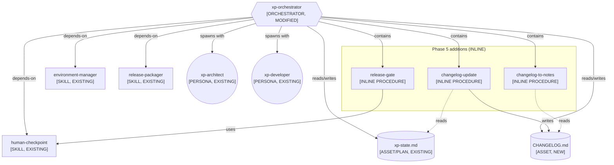
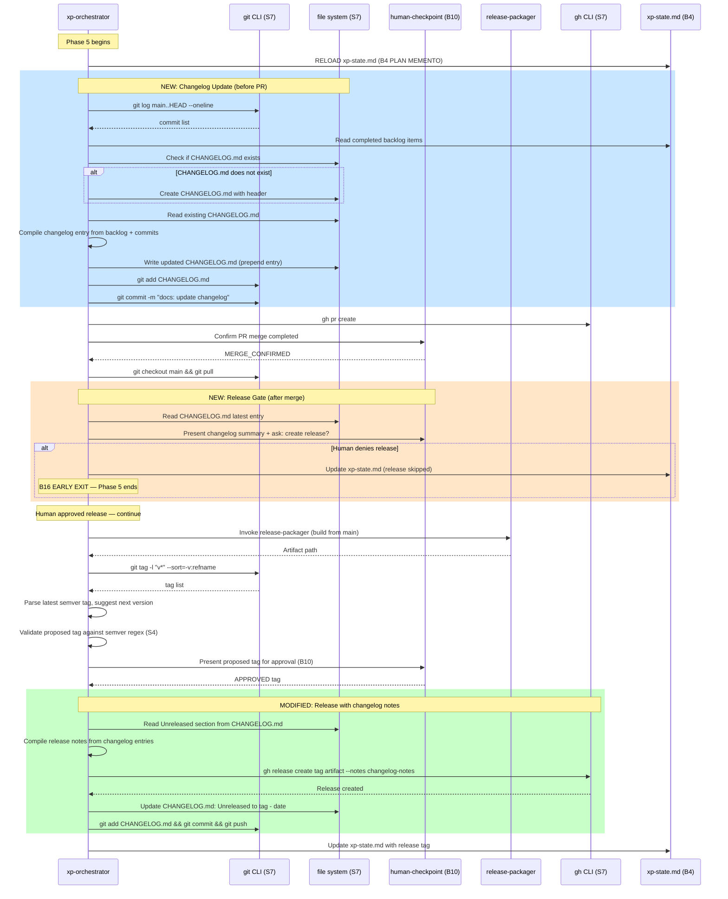
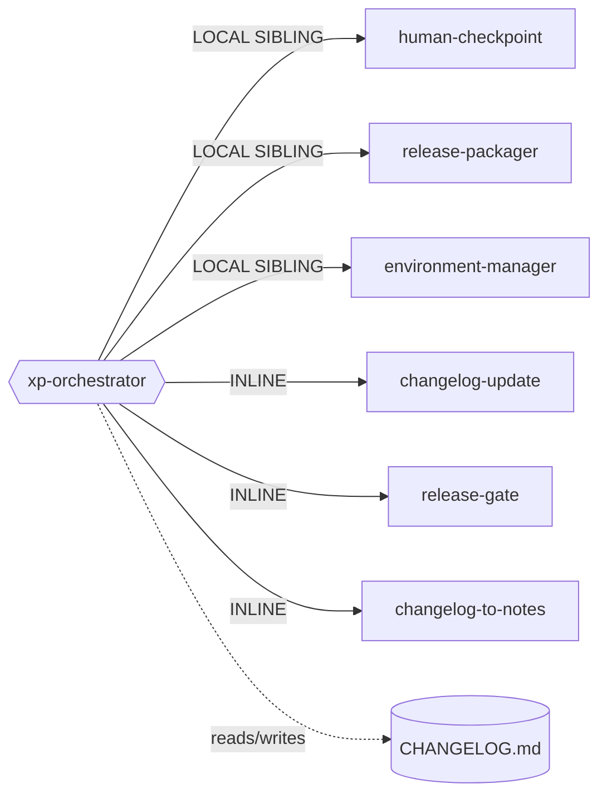

# Genesis Handoff Packet: XP Orchestrator — Changelog + Release Gate

> **Genesis Session**: 2026-07-29
> **Target Module**: `xp-orchestrator` (refactor, Phase 5 only)
> **Cost Stance**: `balanced` (default; operator did not declare)
> **Cost Budget Cap**: none declared
> **Declared Targets**: `common-only`

---

## Step 1 — Intent + Scope

**Capability**: Refactor Phase 5 of the xp-orchestrator to (1) maintain
a running `CHANGELOG.md` at the project root, updated before the pull
request is created so that changelog entries are part of the PR diff
and land on `main` with the merge; and (2) insert a human release gate
after PR merge confirmation that asks the operator whether a release
is warranted for this cycle — if denied, Phase 5 ends early (B16 EARLY
EXIT); if approved, the changelog entries are compiled into release
notes and the existing packaging + tagging flow continues.

**Boundary**: This design does NOT touch Phases 0-4. It does NOT change
the `release-packager` skill. It does NOT change the `human-checkpoint`
skill (it reuses it). It does NOT change the `xp-state.template.md`
structure (it adds checkpoint entries using the existing format). It
does NOT introduce automatic release-worthiness logic — the human
decides. It does NOT change Phase 3 continuous-build tags or uploads.

**What changes**: Four modifications to the xp-orchestrator's Phase 5
body:

1. A changelog-update procedure inserted BEFORE `gh pr create` — reads
   completed backlog items from `xp-state.md`, reads git log for
   feature-branch commits, writes/updates `CHANGELOG.md`, commits the
   change to the feature branch.
2. A human release gate inserted AFTER merge confirmation + checkout
   main — presents the changelog entries and asks whether a release
   should be created.
3. A B16 EARLY EXIT path when the human denies the release.
4. Changelog-sourced release notes replacing the hardcoded `--notes
   "Release <tag>"` string in `gh release create`.

**Dispatch Description**: No change to the existing xp-orchestrator
description. This is an INLINE refinement of Phase 5 within the
SKILL.md body.

**Invocation mode**: FORCED (the xp-orchestrator is always invoked
explicitly or by workflow progression, never by discovery dispatch).

---

## Step 2 — Component Diagram

### Refactor-pattern triggers (R1-R6) against existing module graph

- **R1 SPLIT**: No trigger. The xp-orchestrator description does not
  contain "and" connecting two distinct capabilities — it is one
  orchestrator with sequential phases. No fragment callers. Body is
  currently 95 lines; after this change it will be ~120 lines (well
  under the 500-line budget). Single lens (orchestration). No
  divergent change cadence.
  **VERDICT**: No split needed.

- **R2 FUSE**: No trigger. No dispatch collision with siblings. No
  lockstep co-invocation.
  **VERDICT**: No fuse.

- **R3 EXTRACT**: No trigger. The changelog procedure is unique to
  this orchestrator's Phase 5. No reuse pressure from other modules.
  The release gate is a new invocation of the existing
  `human-checkpoint` skill, not extractable content.
  **VERDICT**: Keep inline.

- **R4 INLINE**: Not applicable (no thin proxies exist).

- **R5 COST PRUNE**: Not triggered by this change.

- **R6 AUDIENCE-BOUNDARY ENFORCE**: Not triggered — no task() spawn
  is being added by this change.

### Component diagram



**Key decision**: All three additions (changelog-update,
release-gate, changelog-to-notes) are INLINE procedures within
the xp-orchestrator body, not separate skills. Rationale: no R1
SPLIT triggers fire; the content is unique to this orchestrator's
Phase 5; extracting any of them would be PREMATURE SPLIT.

---

## Step 3 — Thread / Sequence Diagram

**Tier 3 architectural pattern**: The xp-orchestrator already
realizes **PIPELINE** (A2) + **STAFFED PLAN** (A4). This change
does not alter the architectural pattern — it adds inline
procedures, a B10 HUMAN CHECKPOINT gate, and a B16 EARLY EXIT
path within Phase 5's existing pipeline stage.

**Tier 2 design patterns applied by this change**:

- **S7 DETERMINISTIC TOOL BRIDGE**: `git log` to read commit
  history (fact that must be true); file read/write for
  `CHANGELOG.md` (side effect); `git add` + `git commit` to
  commit changelog changes (side effect). All grounded via tool
  calls.
- **B10 HUMAN CHECKPOINT**: Release gate — human decides whether
  this cycle warrants a release (already used elsewhere in the
  orchestrator; new invocation point).
- **B16 EARLY EXIT**: If human denies release, skip packaging +
  tagging + release creation entirely. Saves cost and avoids
  unnecessary artifacts.
- **S4 VALIDATION DECORATOR**: Semver tag validation (already
  exists from prior refactor; unchanged).
- **B8 ATTENTION ANCHOR**: Already present via xp-state.md reload.
- **B4 PLAN MEMENTO**: Already present via xp-state.md.

**No new threads are spawned by this change**. The entire addition
runs in the orchestrator's main thread.



### Step 3.1 — Tradeoff Check

No tradeoff tension. Each pattern fills an unambiguous slot:

- S7 is the only pattern for git/file operations (fact + side effects).
- B10 is the only pattern for the release gate (consequential human decision).
- B16 is the only pattern for "skip remaining steps" (cost savings).

**Step 3.1 skipped** — unambiguous pattern selection.

### Step 3.2 — Cost Check

| Module | Role Class | Prefix Shape | Output Volume | Tool Surface | Workflow Shape |
|--------|-----------|-------------|---------------|-------------|----------------|
| xp-orchestrator (Phase 5 delta) | implementer | M (stable; xp-state reload is variable suffix) | S (changelog text + CLI output) | 4 tools: git, gh, file read, file write (minimal) | Sequential within pipeline stage |

**Cost impact of this change**: Low-positive. Adds ~4-6 extra tool
calls for changelog operations, one human checkpoint interaction
for the release gate, and conditional early exit that SAVES cost
when release is denied (skips release-packager invocation + tag
operations + release creation). Net cost is approximately zero on
approved-release runs and negative on denied-release runs.

**No PER-SPAWN DECLARATION TABLE needed** — this change adds no
task() spawns.

### Step 3.5 — Composition Decision

| Box | Composition Mode | Rationale |
|-----|-----------------|-----------|
| changelog-update (read git log + backlog, write CHANGELOG.md) | **INLINE** | Unique to this orchestrator's Phase 5. ~15-20 lines of procedure. No reuse pressure from any other module. Extracting would be PREMATURE SPLIT. |
| release-gate (present changelog, ask human, branch on answer) | **INLINE** | Unique to Phase 5. ~8-10 lines. Reuses existing human-checkpoint via depend-on. |
| changelog-to-notes (read changelog, compile notes for gh release) | **INLINE** | Unique to Phase 5's release creation step. ~5-8 lines. No other module needs this. |
| CHANGELOG.md | **INLINE** (project-root asset) | A project-level file managed by the orchestrator. Not a module dependency — just a file the procedure reads/writes. |
| human-checkpoint | **LOCAL SIBLING** (existing) | Already exists at `.agents/skills/human-checkpoint/`. |
| release-packager | **LOCAL SIBLING** (existing) | No change. |
| xp-state.md | **LOCAL SIBLING** (existing asset) | No structural change needed. |

**Dependency graph** (no new external edges):



**External modules required**: None. No DECLARATION MECHANISM needed.

---

## Step 4 — SoC Pass

| Check | Result |
|-------|--------|
| Does an existing module already handle changelog? | **No**. No sibling skill handles changelogs. |
| Does an existing module already handle release gating? | **No**. `human-checkpoint` is the gate mechanism, but the decision logic is unique to this orchestrator. |
| Does this overlap a sibling's trigger conditions? | **No**. `release-packager` handles build/bundle; this is changelog + gating. |
| Dispatch description collision? | **No change to description**. No new skill created. |
| R1 SPLIT triggers? | **None fire**. After additions, body is ~120 lines, single lens, no description conjunction, no fragment callers. |
| R2 FUSE triggers? | **None fire**. |
| R3 EXTRACT triggers? | **None fire** — no duplicated content, no wrong-lens inline. |
| R4 INLINE triggers? | **Not applicable**. |
| Consequential side effects left as LLM-asserted? | **All grounded via S7**: writing CHANGELOG.md (file write tool), committing (git CLI), reading commits (git log CLI), reading backlog (file read), creating release with notes (gh CLI). |
| Facts left as LLM-asserted? | **All grounded via S7**: commit history (git log), completed tasks (xp-state.md read), CHANGELOG.md existence (file check), changelog content (file read). |

**No open findings.**

---

## Step 5 — Compliance Check

| Principle | Status | Finding |
|-----------|--------|---------|
| Separation of Concerns | PASS | Changelog + release gating stays in the orchestrator where releases are managed. |
| Single Responsibility | PASS | Orchestrator still has one job: lifecycle orchestration. |
| Encapsulation | PASS | Inline procedures; no new public surface. |
| Composition over inheritance | PASS | Reuses existing human-checkpoint via depend-on. |
| Dependency inversion | PASS | Design against common substrate (git, gh, file tools). |
| S7 DETERMINISTIC TOOL BRIDGE | PASS | All file/git/gh operations cross the bridge. |
| B10 HUMAN CHECKPOINT | PASS | Human decides whether release is warranted. |
| B16 EARLY EXIT | PASS | Explicit early termination when release denied. |
| Truth #1 (CONTEXT IS FINITE) | PASS | xp-state.md reload at Phase 5 start. |
| Truth #2 (CONTEXT EXPLICIT) | PASS | All content read from files, not recalled. |
| Truth #3 (OUTPUT IS PROBABILISTIC) | PASS | Changelog is template-driven. Tags validated by regex. |
| Truth #4 (HALLUCINATION IS INHERENT) | PASS | All facts grounded via tool calls. |
| Truth #5 (PRETRAINING IS FROZEN) | PASS | All state read live from git + files. |
| Truth #6 (HARNESSES BRIDGE) | PASS | All mutations go through tool calls. |
| MODULE ENTRYPOINT spec | PASS | `name` matches directory. Body stays under 500 lines (~120 lines). |
| PROSE: Progressive Disclosure | PASS | Changelog procedure inline in Phase 5; no eager asset load. |
| PROSE: Reduced Scope | PASS | Only Phase 5 affected. |
| PROSE: Orchestrated Composition | PASS | Reuses existing skills. |
| PROSE: Safety Boundaries | PASS | Human checkpoint before release creation. Early exit path. |
| PROSE: Explicit Hierarchy | PASS | Orchestrator sequences; skills do work. |

**No BLOCKERs. No open findings.**

---

## Step 6 — Handoff Packet

### 6.1 Diagrams

See Step 2 (component diagram), Step 3 (sequence diagram), and
Step 3.5 (dependency graph) above. All three are part of this packet.

### 6.2 Interface Sketch

**Module**: `xp-orchestrator` (existing, INLINE modification to Phase 5)

| Field | Value |
|-------|-------|
| **Name** | `xp-orchestrator` |
| **Trigger** | Existing (no change to description) |
| **Inputs** | User request or feature backlog; xp-state.md; CHANGELOG.md (if exists) |
| **Outputs** | Updated xp-state.md; Updated/created CHANGELOG.md; GitHub release with semver tag and changelog-sourced notes (conditional on human approval) |
| **Dependencies** | `human-checkpoint`, `environment-manager`, `release-packager`, `xp-architect` persona, `xp-developer` persona |
| **Change scope** | Phase 5: restructured with changelog update before PR, release gate after merge, early exit path, changelog-sourced release notes |

### 6.3 Module Composition Table

| Box | Mode | Rationale |
|-----|------|-----------|
| xp-orchestrator | EXISTING (modified) | Inline refinement of Phase 5 |
| changelog-update | INLINE | Read git log + backlog, write CHANGELOG.md, commit. ~15-20 lines. No reuse pressure. |
| release-gate | INLINE | Present changelog, invoke human-checkpoint, branch. ~8-10 lines. Unique to Phase 5. |
| changelog-to-notes | INLINE | Read changelog, compile notes string for gh release. ~5-8 lines. Unique to Phase 5. |
| CHANGELOG.md | PROJECT-ROOT ASSET | Managed by orchestrator, lives at repo root, versioned with git. |
| human-checkpoint | LOCAL SIBLING (existing) | Already depends on it |
| release-packager | LOCAL SIBLING (existing) | No change |
| environment-manager | LOCAL SIBLING (existing) | No change |
| xp-state.md | LOCAL SIBLING (existing asset) | No structural change; new checkpoint entries use existing format |

### 6.4 External Modules Required

**None.**

### 6.5 Declared Target Set

`common-only` — uses only preloaded terminal tools (git, gh, file
read/write) and substrate concepts (plan persistence, human
checkpoint, early exit).

### 6.6 Invocation Mode

| Module | Mode |
|--------|------|
| xp-orchestrator | FORCED |

### 6.7 Open Compliance Findings

**None.** All checks pass.

### 6.8 Todo List

| # | Task | Dependencies | Status |
|---|------|-------------|--------|
| 1 | Draft updated Phase 5 body in xp-orchestrator SKILL.md | — | **done** |
| 2 | Validate emitted module against this handoff packet (Step 8) | 1 | **done** |

### 6.9 Changelog Convention Specification

The following convention MUST be followed by the changelog-update
procedure in the emitted Phase 5 body:

**File**: `CHANGELOG.md` at the project root.

**Format**: [Keep a Changelog](https://keepachangelog.com/en/1.1.0/)
conventions, simplified for this project:

```markdown
# Changelog

All notable changes to this project will be documented in this file.

## [Unreleased]

### Added
- Feature X: brief description

### Changed
- Description of change

### Fixed
- Description of fix

## [v0.12.0-beta] - 2026-07-27

### Added
- Flexible meal sorting with alphabetical sort option
```

**Category mapping**:
- **Added**: New backlog items with status `done` that introduce new
  user-facing capabilities.
- **Changed**: Backlog items that modify existing behavior.
- **Fixed**: Backlog items that correct bugs or issues found during
  manual testing (Phase 4 feedback cycles).

**Procedure** (changelog-update):

1. Run `git log main..HEAD --oneline` to get commit history for the
   feature branch (S7).
2. Read `.agents/plans/xp-state.md` Section 2 (Active Goal) and
   Section 4 (Work Backlog) to get the feature name and completed
   tasks (S7).
3. Check if `CHANGELOG.md` exists at the project root (S7 file check).
   - If it does NOT exist, create it with the header template above.
   - If it DOES exist, read its current content.
4. Compile a new entry under `## [Unreleased]`:
   - Categorize each completed backlog item as Added / Changed / Fixed
     based on its title and the feature context.
   - Use the backlog item titles as the basis for entry descriptions.
   - Keep entries concise (one line each).
5. If an `## [Unreleased]` section already exists, PREPEND the new
   entries to it (multiple development cycles may contribute before
   a release). If it does not exist, create one after the header.
6. Write the updated `CHANGELOG.md` (S7 file write).
7. Stage and commit: `git add CHANGELOG.md` then
   `git commit -m "docs: update changelog for <feature-name>"` (S7).

**Procedure** (changelog-to-notes, at release creation):

1. Read `CHANGELOG.md` and extract the `## [Unreleased]` section
   content (everything between `## [Unreleased]` and the next `##`
   heading or end of file).
2. Use that content as the `--notes` argument to `gh release create`.
3. After release creation succeeds, update `CHANGELOG.md`:
   - Replace `## [Unreleased]` with `## [<approved-tag>] - <date>`
     (e.g. `## [v0.13.0-beta] - 2026-07-29`).
   - Add a fresh empty `## [Unreleased]` section above it.
4. Commit and push:
   `git add CHANGELOG.md && git commit -m "docs: mark changelog <tag>" && git push origin main`
   (S7).

### 6.10 Release Gate Specification

The release gate is a NEW B10 HUMAN CHECKPOINT inserted between
"checkout main + pull" and "invoke release-packager".

**Procedure** (release-gate):

1. Read the latest `## [Unreleased]` section from `CHANGELOG.md` to
   summarize what changed in this cycle.
2. Invoke the `human-checkpoint` skill. Present:
   - A summary of the changes from the changelog.
   - The question: "Would you like to create a release for these
     changes?"
   - Options:
     - **Create release**: Proceed with packaging, tagging, and
       release creation (existing steps 6-10).
     - **Skip release**: End Phase 5 now. Changes are merged to
       main but no release artifact is created.
3. If the human selects **Skip release**:
   - Update `.agents/plans/xp-state.md` Section 6 (Checkpoints)
     to record: `- [x] Release Skipped (human decision)`.
   - **HALT Phase 5** (B16 EARLY EXIT). Do NOT invoke
     release-packager, do NOT determine a tag, do NOT create a
     release. Execution ends.
4. If the human selects **Create release**:
   - Continue with the existing Phase 5 flow (release-packager,
     tag determination, tag approval, release creation with
     changelog-sourced notes).

### 6.11 Revised Phase 5 Step Outline

For clarity, the complete revised Phase 5 step sequence:

1. **Changelog Update** (NEW): Compile and commit CHANGELOG.md.
2. **Create PR** (existing): `gh pr create`.
3. **Confirm Merge** (existing): Human checkpoint to confirm merge.
4. **Checkout main** (existing): `git checkout main && git pull`.
5. **Release Gate** (NEW): Human checkpoint — create release or skip?
   - If skip: update xp-state.md, HALT (B16).
6. **Package** (existing, conditional): Invoke release-packager.
7. **Determine Next Semver Tag** (existing, conditional): Read tags,
   suggest next, validate regex (S4).
8. **Tag Approval Gate** (existing, conditional): Human approves
   tag (B10).
9. **Create Release with Changelog Notes** (MODIFIED, conditional):
   `gh release create` with `--notes` sourced from CHANGELOG.md.
   Then update CHANGELOG.md to mark the version.
10. **Update xp-state.md** (existing): Record final release tag.

### 6.12 HUMAN_RATIONALE

> **NEVER copied into any SPAWN_BRIEF** (no spawns in this design).

The user observed two pain points in the current Phase 5:

**Pain point 1 — No changelog.** The project accumulates features
across development cycles but has no running record of what changed.
Release notes are generated ad-hoc by the LLM at release time with
`--notes "Release <tag>"`, producing uninformative notes. A running
`CHANGELOG.md` maintained incrementally (updated each cycle, before
the PR) solves this: it is committed to the repository, survives
across sessions, and provides grounded material for release notes.
The Keep a Changelog format is chosen because it is widely
recognized, simple to parse, and already structures entries by
category (Added/Changed/Fixed).

The changelog MUST be updated before `gh pr create` (not after merge)
so that the changelog diff is part of the PR. This ensures the human
reviewing the PR can see the changelog entry, and the merge to main
brings the changelog with it.

**Pain point 2 — Every merge triggers a release.** The current Phase
5 always proceeds from PR merge to packaging + tagging + release.
But many small changes (bug fixes, minor improvements) don't warrant
a standalone release. The user wants a gate where they can say "this
is merged, but don't release yet — accumulate more changes first."
The B16 EARLY EXIT pattern is the minimal mechanism: if the human
declines the release, Phase 5 halts after merge. The changelog
entries remain in `CHANGELOG.md` under `## [Unreleased]` and will
be included in the NEXT release whenever the human approves one.

The two features compose cleanly: the changelog accumulates entries
across N denied-release cycles, and when a release is finally
approved, all accumulated entries become the release notes.

### 6.13 Evals Plan

**Content Evals** (3 scenarios):

| # | Prompt | Expected (with change) | Expected (without change) |
|---|--------|------------------------|---------------------------|
| CE1 | "Ship the current feature" (first release, no CHANGELOG.md) | Creates CHANGELOG.md with header + Unreleased section, commits, PR, merge, release gate, on approval: packages, tags, release with changelog notes, updates CHANGELOG.md | PR, merge, packages, tags, release with generic notes |
| CE2 | "Ship the current feature" (CHANGELOG.md exists, human DENIES release) | Appends entries to Unreleased, commits, PR, merge, release gate, human skips, xp-state updated, HALT. No packaging/tagging/release. | PR, merge, packages, tags, release (no way to skip) |
| CE3 | "Ship the current feature" (accumulated entries from 2 prior denied cycles, human APPROVES) | Appends entries, PR, merge, gate approved, packages, tags, release notes include ALL accumulated entries, CHANGELOG.md marked with version | Release with only current cycle's ad-hoc notes |

**Trigger Evals**: N/A — no new skill is being created. The
xp-orchestrator's description is unchanged.

### 6.14 Cost Projection

**Per-module qualitative bands**:

| Module | Role Class | Prefix Band | Output Band | Turn/Cache Ratio |
|--------|-----------|-------------|-------------|------------------|
| xp-orchestrator (Phase 5 delta) | implementer | M (stable persona + skill text) | S (changelog text, CLI output, gate prompt) | ~4-6 extra turns, high cache ratio (prefix stable) |

**Workflow-level quantitative range** (Phase 5 delta only):

| Scenario | Extra Input Tokens | Extra Output Tokens | Extra Cost (est.) |
|----------|--------------------|---------------------|-------------------|
| S (single feature, release denied) | ~400 | ~200 | ~$0.002 (SAVES ~$0.01 by skipping packaging) |
| M (single feature, release approved) | ~800 | ~500 | ~$0.005 |
| L (3 cycles accumulated, release approved) | ~1200 | ~800 | ~$0.008 |

**Cited cost patterns**: B16 EARLY EXIT (denied-release path saves
the cost of release-packager invocation + tag operations). No other
cost patterns needed.

**Cost-shape matrix row**: Not applicable — no cost-pattern tension.

**Declared stance**: `balanced` (default).

**Cap check**: No cap declared. L scenario is negligible ($0.008).

---

> **DESIGN ENDS HERE.** The handoff packet above is the plan.
> Step 7a/7b (portability check + drafting) and Step 8 (validation)
> are the caller's responsibility.

---

## Execution Status

| Step | Status |
|------|--------|
| 7a Portability check | **done** — all affordances common-only |
| 7b Draft natural-language module | **done** — SKILL.md updated (lines 67-121) |
| 8 Validate | **done** — all checks pass (see below) |
