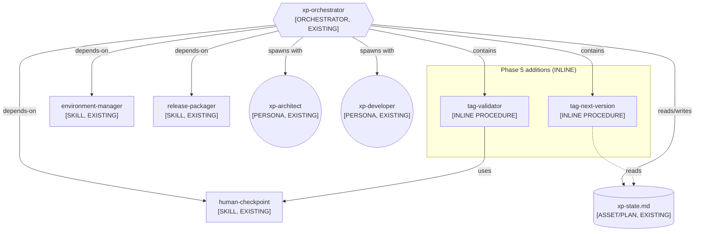
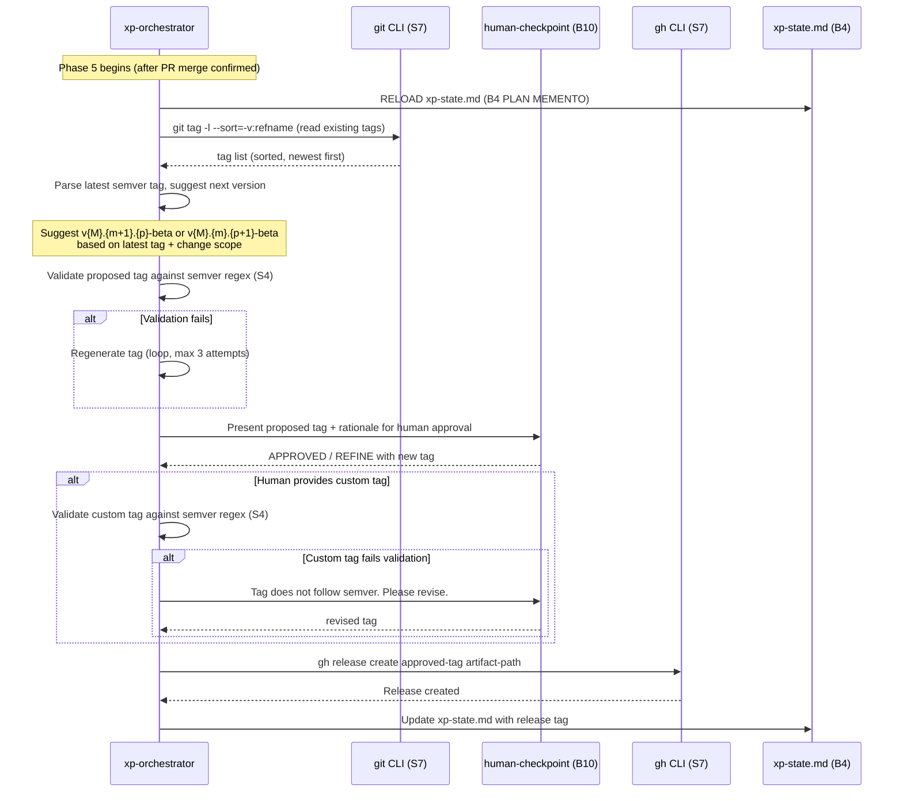
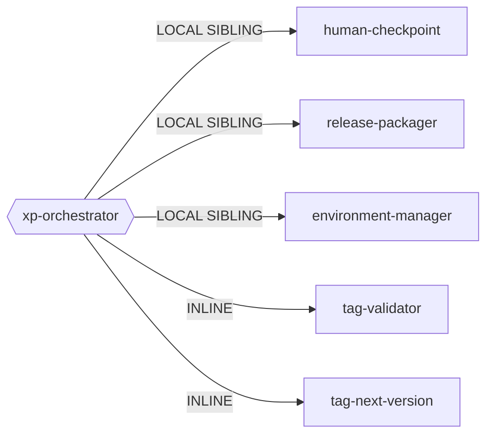

# Genesis Handoff Packet: XP Orchestrator — Release Tag Convention Enforcement

> **Genesis Session**: 2026-07-27
> **Target Module**: `xp-orchestrator` (refactor, Phase 5 only)
> **Cost Stance**: `balanced`
> **Cost Budget Cap**: none declared
> **Declared Targets**: `common-only`

---

## Step 1 — Intent + Scope

**Capability**: Enforce semantic versioning (semver) conventions on git tags
created during the xp-orchestrator's Phase 5 (GitHub PR & Release). The
orchestrator currently emits `gh release create <tag-name> <artifact-path>`
with no convention enforcement — the tag name is ad-hoc, determined by
whatever the LLM generates. The refactor adds a deterministic validation
gate that ensures the tag follows `v<MAJOR>.<MINOR>.<PATCH>[-<prerelease>]`
(semver 2.0.0 spec), reads the latest existing tag from the repository to
suggest the next version, and presents the proposed tag to the human for
approval before creation.

**Boundary**: This design does NOT touch Phase 3 continuous tags, does NOT
change the release-packager skill, does NOT introduce automatic version
bumping logic (major vs minor vs patch is a human decision), and does NOT
modify the xp-state template's Section 7 structure.

**What changes**: Three additions to the xp-orchestrator's Phase 5 body:
1. A deterministic step to read the latest semver tag from `git tag -l`.
2. A validation gate (S4) that checks the proposed tag against the semver
   regex before `gh release create` runs.
3. A human checkpoint (B10) presenting the proposed tag for approval/edit
   before creation.

**Dispatch Description** (for the refactored xp-orchestrator — no change
to the existing description, since this is an internal phase refinement,
not a new skill):

The existing description remains unchanged. This is an INLINE refinement
of Phase 5 within the xp-orchestrator SKILL.md body.

**Invocation mode**: FORCED (the xp-orchestrator is always invoked
explicitly or by workflow progression, never by discovery dispatch).

---

## Step 2 — Component Diagram

Refactor-pattern triggers checked (R1-R6) against existing module graph:

- **R1 SPLIT**: No trigger. The xp-orchestrator description does not
  contain "and" connecting two distinct capabilities — it is one
  orchestrator with phases. No fragment callers (it's always invoked
  whole). Body is 79 lines (well under budget). Single lens
  (orchestration). No divergent change cadence between phases.
  **VERDICT**: No split needed.

- **R2 FUSE**: No trigger. No dispatch collision with siblings. No
  lockstep co-invocation with another skill. **VERDICT**: No fuse.

- **R3 EXTRACT**: No trigger for the tag convention content. The
  semver validation is unique to this orchestrator's Phase 5. No
  reuse pressure from other modules. **VERDICT**: Keep inline.

- **R4 INLINE**: Not applicable (no thin proxies exist).

- **R5 COST PRUNE**: Not triggered by this change. The orchestrator
  already has a reasonable cost shape.

- **R6 AUDIENCE-BOUNDARY ENFORCE**: Not triggered — no task() spawn
  is being added by this change.

**Component diagram** (existing modules + the inline additions):



**Key decision**: The tag validation and next-version suggestion are
INLINE procedures within the xp-orchestrator body, not separate
skills. Rationale: no R1 SPLIT triggers fire; the content is unique
to this orchestrator's Phase 5; extracting it would be PREMATURE SPLIT.

---

## Step 3 — Thread / Sequence Diagram

**Tier 3 architectural pattern**: The xp-orchestrator already realizes
**PIPELINE** (A2) + **STAFFED PLAN** (A4). This change does not alter
the architectural pattern — it adds an S4 VALIDATION DECORATOR + B10
HUMAN CHECKPOINT gate within Phase 5's existing pipeline stage.

**Tier 2 design patterns applied by this change**:
- **S4 VALIDATION DECORATOR**: Wraps the `gh release create` command
  with a deterministic semver regex check.
- **S7 DETERMINISTIC TOOL BRIDGE**: `git tag -l` to read existing tags
  (fact that must be true); `gh release create` for the release (
  consequential side effect). Both already exist in Phase 5 but the
  tag naming was ungrounded.
- **B10 HUMAN CHECKPOINT**: Present proposed tag for approval (already
  used elsewhere in the orchestrator).
- **B8 ATTENTION ANCHOR**: Already present via xp-state.md reload.
- **B4 PLAN MEMENTO**: Already present via xp-state.md.

**No new threads are spawned by this change**. The entire addition
runs in the orchestrator's main thread.



### Step 3.1 — Tradeoff Check

No tradeoff tension. S4 VALIDATION DECORATOR is the unambiguous
pattern for deterministic format checking. B10 HUMAN CHECKPOINT is
the unambiguous pattern for tag approval (consequential + requires
human judgement on version bump type). **Step 3.1 skipped**.

### Step 3.2 — Cost Check

| Module | Role Class | Prefix Shape | Output Volume | Tool Surface | Workflow Shape |
|--------|-----------|-------------|---------------|-------------|----------------|
| xp-orchestrator (Phase 5 delta) | implementer | M (stable; xp-state reload is variable suffix) | S (tag string + CLI output) | 2 tools: git, gh (minimal) | Sequential within pipeline stage |

**Cost impact of this change**: Negligible. Adds ~2 extra tool calls
(git tag -l, semver validation) and one human checkpoint interaction
to an already-existing Phase 5. No new threads, no fan-out, no model
class change. The orchestrator already runs at implementer class.

**No PER-SPAWN DECLARATION TABLE needed** — this change adds no
task() spawns.

### Step 3.5 — Composition Decision

| Box | Composition Mode | Rationale |
|-----|-----------------|-----------|
| tag-validator (semver regex check) | **INLINE** | Unique to this orchestrator's Phase 5. 5-10 lines of procedure. No reuse pressure. Extracting would be PREMATURE SPLIT. |
| tag-next-version (read + suggest) | **INLINE** | Reads `git tag -l`, parses latest tag, suggests increment. 10-15 lines. No other module needs this. |
| human-checkpoint | **LOCAL SIBLING** (existing) | Already exists as `.agents/skills/human-checkpoint/`. |
| xp-state.md | **LOCAL SIBLING** (existing asset) | Already exists as `.agents/plans/xp-state.md`. |

**Dependency graph** (no new edges — only internal additions):



**External modules required**: None. No DECLARATION MECHANISM needed.

---

## Step 4 — SoC Pass

| Check | Result |
|-------|--------|
| Does an existing module already do tag validation? | **No**. No sibling skill handles semver tag validation. |
| Does this overlap a sibling's trigger conditions? | **No**. release-packager handles build/bundle; this is tag naming. |
| Dispatch description collision? | **No change to description**. No new skill created. |
| R1 SPLIT triggers? | **None fire** (see Step 2 analysis). |
| R2 FUSE triggers? | **None fire**. |
| R3 EXTRACT triggers? | **None fire** — no duplicated content, no wrong-lens inline. |
| R4 INLINE triggers? | **Not applicable**. |
| Consequential side effect left as LLM-asserted? | **Addressed**. `gh release create` already crosses S7 DETERMINISTIC TOOL BRIDGE. The tag NAME was previously LLM-asserted (HAND-ROLLED HALLUCINATION risk). This refactor grounds it via: (1) reading existing tags with `git tag -l` (S7), (2) validating against semver regex (S4), (3) human approval (B10). |
| Fact that must be true left as LLM-asserted? | **Addressed**. "The latest tag is X" was previously unverified. Now grounded via `git tag -l --sort=-v:refname`. |

**Key SoC finding (HIGH, now resolved)**:
The original Phase 5 had a HAND-ROLLED HALLUCINATION risk: the tag name
was generated by the LLM with no grounding against existing tags and no
format validation. This is a consequential fact (the tag goes to GitHub
as a permanent release identifier) that must cross the S7 bridge. The
refactor resolves this.

---

## Step 5 — Compliance Check

| Principle | Status | Finding |
|-----------|--------|---------|
| Separation of Concerns | PASS | Tag convention is in the orchestrator (where releases are created), not leaked into release-packager. |
| Single Responsibility | PASS | Orchestrator still has one job: lifecycle orchestration. Tag naming is part of Phase 5's release step. |
| Encapsulation | PASS | Inline procedure; no new public surface. |
| Composition over inheritance | PASS | Reuses existing human-checkpoint via depend-on. |
| Dependency inversion | PASS | Design against common substrate (git, gh are preloaded terminal tools). |
| S7 DETERMINISTIC TOOL BRIDGE | PASS | Both git tag reading and gh release creation cross the bridge. |
| B10 HUMAN CHECKPOINT | PASS | Human approves the tag before creation. |
| Truth #3 (OUTPUT IS PROBABILISTIC) | PASS | Semver regex validation gates the LLM's tag suggestion. |
| Truth #4 (HALLUCINATION IS INHERENT) | PASS | Latest tag is read from git (S7), not recalled by LLM. |
| Truth #5 (PRETRAINING IS FROZEN) | PASS | Semver spec is stable, but actual tag state is read live. |
| Truth #6 (HARNESSES BRIDGE) | PASS | All mutations go through tool calls. |
| MODULE ENTRYPOINT spec | PASS | `name` field `xp-orchestrator` matches directory. Body stays well under 500 lines / 5000 tokens. |
| PROSE: Progressive Disclosure | PASS | Tag convention is inline in Phase 5; no eager asset load. |
| PROSE: Reduced Scope | PASS | Only Phase 5 affected. |
| PROSE: Safety Boundaries | PASS | Human checkpoint before release creation. |

**No BLOCKERs. No open findings.**

---

## Step 6 — Handoff Packet

### 6.1 Diagrams

See Step 2 (component diagram), Step 3 (sequence diagram), and
Step 3.5 (dependency graph) above. All three are part of this packet.

### 6.2 Interface Sketch

**Module**: `xp-orchestrator` (existing, INLINE modification to Phase 5)

| Field | Value |
|-------|-------|
| **Name** | `xp-orchestrator` |
| **Trigger** | Existing (no change) |
| **Inputs** | User request or feature backlog; xp-state.md |
| **Outputs** | Updated xp-state.md; GitHub release with semver tag |
| **Dependencies** | `human-checkpoint`, `environment-manager`, `release-packager`, `xp-architect` persona, `xp-developer` persona |
| **Change scope** | Phase 5 steps 4-5 replaced with tag convention procedure |

### 6.3 Module Composition Table

| Box | Mode | Rationale |
|-----|------|-----------|
| xp-orchestrator | EXISTING (modified) | Inline refinement of Phase 5 |
| tag-validator | INLINE | Semver regex check, 5-10 lines, no reuse pressure |
| tag-next-version | INLINE | Parse latest tag + suggest next, 10-15 lines |
| human-checkpoint | LOCAL SIBLING (existing) | Already depends on it |
| release-packager | LOCAL SIBLING (existing) | No change |
| environment-manager | LOCAL SIBLING (existing) | No change |
| xp-state.md | LOCAL SIBLING (existing asset) | No structural change |

### 6.4 External Modules Required

**None.**

### 6.5 Declared Target Set

`common-only` — uses only preloaded terminal tools (git, gh) and
substrate concepts (plan persistence, human checkpoint).

### 6.6 Invocation Mode

| Module | Mode |
|--------|------|
| xp-orchestrator | FORCED |

### 6.7 Open Compliance Findings

**None.** All checks pass.

### 6.8 Todo List

| # | Task | Dependencies | Status |
|---|------|-------------|--------|
| 1 | Draft updated Phase 5 body in xp-orchestrator SKILL.md | — | done |
| 2 | Validate emitted module against this handoff packet (Step 8) | 1 | done |

### 6.9 Semver Convention Specification

The following convention MUST be enforced by the tag-validator
procedure in the emitted Phase 5 body:

**Tag format**: `v<MAJOR>.<MINOR>.<PATCH>[-<prerelease>]`

- `v` prefix is mandatory (matches existing tag history).
- `MAJOR`, `MINOR`, `PATCH` are non-negative integers with no
  leading zeros.
- Optional `-<prerelease>` follows semver 2.0.0 section 9: dot-separated
  identifiers of alphanumerics and hyphens.
- Pre-release labels used in this project: `alpha`, `beta`, `rc`.

**Regex for validation**:
```
^v(0|[1-9]\d*)\.(0|[1-9]\d*)\.(0|[1-9]\d*)(-[a-zA-Z0-9]+(\.[a-zA-Z0-9]+)*)?$
```

**Version suggestion logic** (tag-next-version):
1. Read tags with `git tag -l "v*" --sort=-v:refname`.
2. Parse the latest tag matching the semver regex.
3. If no valid tags exist, suggest `v0.1.0-beta`.
4. If latest tag has a pre-release label:
   - If label is `beta`, suggest incrementing MINOR
     (e.g. `v0.9.0-beta` -> `v0.10.0-beta`).
   - The human can override to drop the label (graduation to
     stable) or change the bump type.
5. If latest tag is stable (no pre-release):
   - Suggest `v<MAJOR>.<MINOR+1>.0` (minor bump).
   - The human can override to major or patch bump.

**Current state context** (read from actual repo):
- Latest semver tag: `v0.9.0-beta`
- Project is in beta phase
- Alpha phase is complete; no regression to alpha
- Graduation to stable (`v1.0.0`) is a future human decision

### 6.10 HUMAN_RATIONALE

> **NEVER copied into any SPAWN_BRIEF** (no spawns in this design).

The user's pain point is that Phase 5 of the xp-orchestrator creates
git tags with no enforced naming convention. The LLM picks whatever
tag name seems reasonable, leading to inconsistency (observed tags:
`alpha-latest`, `continuous`, `continuous-build` mixed with semver
tags like `v0.9.0-beta`). Phase 3 continuous tags are explicitly
out of scope per user request.

The fix is surgical: add three steps to Phase 5 before `gh release
create`: (1) read existing tags via S7 tool bridge, (2) validate
against semver regex via S4 decorator, (3) present to human via B10
checkpoint. No new modules, no new threads, no structural change
to the orchestrator.

### 6.11 Evals Plan

**Content Evals** (2 scenarios):

| # | Prompt | Expected Output (with skill) | Expected Output (without skill) |
|---|--------|-----------------------------|---------------------------------|
| CE1 | "Create a release for the current feature" (latest tag: v0.9.0-beta) | Phase 5 reads tags, proposes `v0.10.0-beta`, validates against regex, asks human to approve, then creates release | Phase 5 creates release with ad-hoc tag name (possibly correct but possibly non-semver like `release-2026-07` or `beta-10`) |
| CE2 | "Ship v1.0.0 stable release" (latest tag: v0.9.0-beta, user wants to graduate from beta) | Phase 5 proposes `v1.0.0` (no pre-release), validates, human approves, release created | May or may not produce correct semver; no validation gate |

**Trigger Evals**: N/A — no new skill is being created, so no
dispatch description evaluation is needed. The xp-orchestrator's
description is unchanged.

### 6.12 Cost Projection

**Per-module qualitative bands**:

| Module | Role Class | Prefix Band | Output Band | Turn/Cache Ratio |
|--------|-----------|-------------|-------------|------------------|
| xp-orchestrator (Phase 5 delta) | implementer | M (stable persona + skill text) | S (tag string, CLI output) | ~2 extra turns, high cache ratio (prefix stable) |

**Workflow-level quantitative range** (Phase 5 delta only):

| Scenario | Extra Input Tokens | Extra Output Tokens | Extra Cost (est.) |
|----------|-------------------|--------------------|-|
| S (trivial: single release) | ~500 (git tag output + regex) | ~200 (tag proposal + validation) | ~$0.002 |
| M (normal release with human override) | ~800 | ~400 | ~$0.004 |
| L (multiple retry loops on invalid tag) | ~1500 | ~800 | ~$0.008 |

**Cited cost patterns**: None required — the addition is 2-3 extra
tool calls within an existing pipeline stage. No fan-out, no model
class change, no new threads.

**Cap check**: No cap declared. L scenario is negligible ($0.008).

---

> **DESIGN ENDS HERE.** The handoff packet above is the plan.
> Step 7a/7b (portability check + drafting) and Step 8 (validation)
> are the caller's responsibility.

---

## Execution Status

| Step | Status |
|------|--------|
| 7a Portability check | done (common-only confirmed) |
| 7b Draft natural-language module | done |
| 8 Validate | done (all 14 checks pass) |
